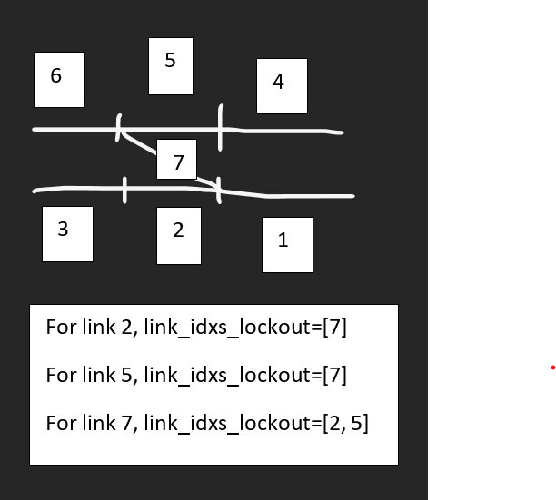

# Rail Network

## How Links Are Connected
The following schematic shows how links in a network are connected:  

In ALTRIOS, each link (path between junctions along the rail with heading, grade, and location) in the rail network has both a direction and a location so each link has a unique link identification (ID) number for each direction.   Each link can must be connected to at least one other link and up to four other links, two in each direction, comprising a previous link, an alternate previous link, a next link, and an alternate next link. Based on the above schematic, we can say that the links are interconnected thusly

| Link ID | Flipped ID | ID Prev | ID Prev Alt | ID Next | ID Next Alt |
|---------|------------|---------|-------------|---------|-------------|
| 1       | 8          | N/A     | N/A         | 4       | N/A         |
| 2       | 9          | N/A     | N/A         | 3       | N/A         |
| 3       | 10         | 2       | N/A         | 4       | N/A         |
| 4       | 11         | 1       | 3           | 7       | 5           |
| 5       | 12         | 4       | N/A         | 6       | N/A         |
| 6       | 13         | 5       | N/A         | N/A     | N/A         |
| 7       | 14         | 4       | N/A         | N/A     | N/A         |
| 8       | 1          | 11      | N/A         | N/A     | N/A         |
| 9       | 2          | 10      | N/A         | N/A     | N/A         |
| 10      | 3          | 11      | N/A         | 9       | N/A         |
| 11      | 4          | 14      | 12          | 8       | 10          |
| 12      | 5          | 13      | N/A         | 11      | N/A         |
| 13      | 6          | N/A     | N/A         | 12      | N/A         |
| 14      | 7          | N/A     | N/A         | 11      | N/A         |

Note that for a particular link, the links corresponding to the "Prev" and "Next" IDs are swapped in the reverse direction -- i.e. in the forward direction, link 4 has links 1 and 3 as "ID Prev" and "ID Prev Alt", respectively, and in the reverse direction, link 4 becomes 11 and has links 8 and 10 as "ID Next" and "ID Next Alt", respectively.  

## Link Lockout
The following schematic shows how link lockouts occur:  
