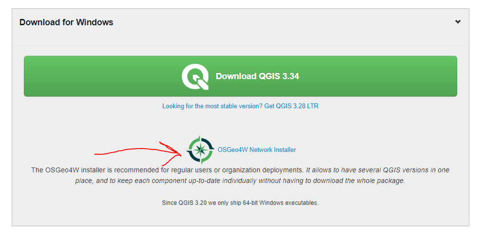
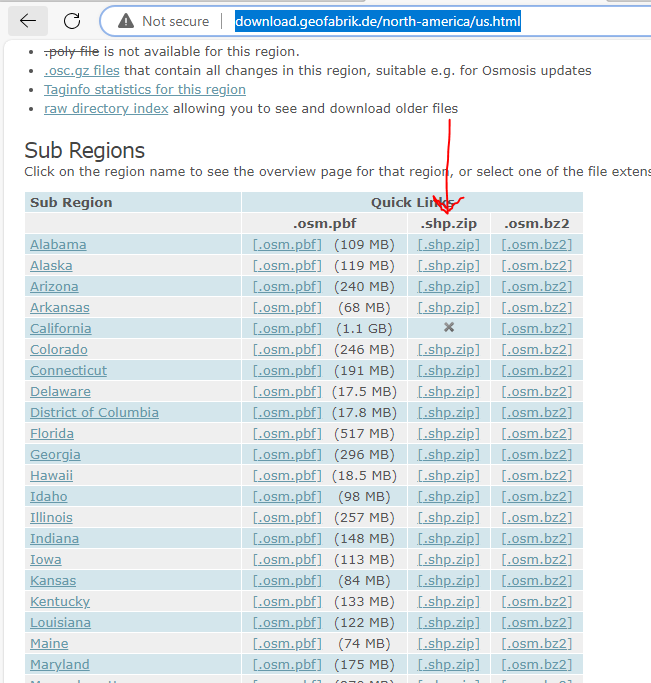
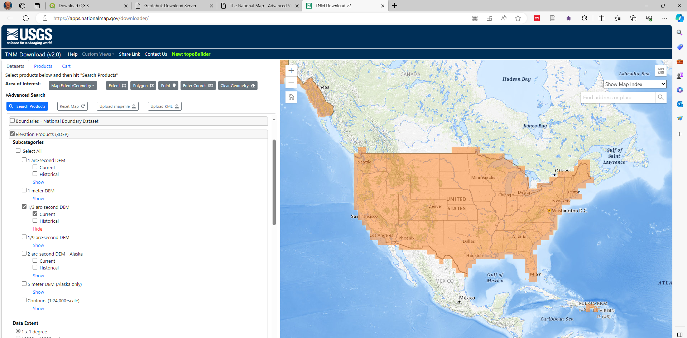

Building a new network from open data sources is large tasks that has several steps.  Below are the five major steps.  

1.	Install software (QGIS, SAGA GIS, and setup python environment)
2.	Gather data
3.	Combine data to span the entire route
4.	Clean/filter data
5.	Convert data to ALTRIOS format

QGIS is the main piece of software that will be used for this process.  You can find it at the link below.  This process was developed using QGIS 3.28, but it may be compatible with later versions.   Make sure that SAGA GIS and GRASS GIS get installed when you install QGIS.  These two packages make up a lot of the QGIS plugins that we will be using for the processing in later steps.

[Download QGIS](https://qgis.org/en/site/forusers/download.html)


The rail data for the network will need to be obtained from openstreetmap data.  This data can be downloaded as shapefiles from Geofrabrik at the link below.  These files will have many layers in addition to the rail data.  You can download these by clicking the .shp.zip link on your state row.  If your route spans multiple states, download those states.  They will be joined together in later steps.  It may be possible to obtain this data in a different manner than avoids this step.  

[Geofabrik Download Server](http://download.geofabrik.de/north-america/us.html)

 

The elevation data will also need to be downloaded to cover your route.  Data for the US can be downloaded from the USGS.  The USGS data can be downloaded through the national map website if it is just a few tiles. If you need more that a few, its probably best to follow a lengthier process.

[TNM Download v2 (nationalmap.gov)](https://apps.nationalmap.gov/downloader/)


When you get to the national map viewer/downloader, you will want to click on the 1/3 arc second data as shown in the picture.  There are higher resolution datasets, but they seem to be typically tied to urban areas, and I don’t know that they may not provide a whole lot more value than the 1/3 arc second data.  It could be possible to use a lower resolution if needed, but It is unknown what the impact would be.  Some investigation would be required to validate the model using this resolution. 

Once selected the area of interest is selected, a list of rasters will be shown that span that area.  This could be a very long or very short list depending on the size of the network.  The geotiff format is what has been used in QGIS.  If you only have a few to download, just download them through the website.  If you have many to download, you will want to download the csv file that lists them all.  I have attached a text file that is a python script that will download all of the files listed in the csv file.  You can either change the extension to a py or just copy the contents into a python script.

 [Python Download Script](network-files/Download%203DEP%20Data.py)

The script has two variables that need to be edited.  You will need to point the File variable at the csv file that you downloaded from the National Map Downloader.  The folder for raw data variable is where you want to download the raster data. The dowload process may take a while and use considerable harddrive space.  Only download what you need.   

```python
# -*- coding: utf-8 -*-
"""
Created on Wed Dec 28 08:57:22 2022

@author: ganderson
"""

import pandas as pd
import requests
import os

File = 'D:/Projects/ALTRIOS/Data For NREL/GIS/Shape File to NEtwork/Elevation Data/URLs For 3DEP Data for lower 48 states.csv'


FolderForRawData = 'D:/Projects/ALTRIOS/Data For NREL/GIS/Shape File to NEtwork/Elevation Data/GeoTiffs/'

URLData = pd.read_csv(File)
```
